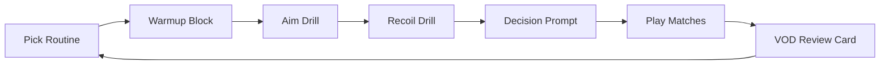

# Black Ops 7 Trainer 

Some players chase “shortcuts.” This project chases **skill**—the kind you can feel in your hands when the lobby gets loud and the last bullet matters. **Black Ops 7 Trainer** is a practice-and-performance companion designed to help you build repeatable mechanics: steadier tracking, cleaner recoil, faster decision-making, and calmer movement under pressure.

It’s not an exploit, not a cheat, not a promise of instant glory. It’s a **training utility**: a structured toolkit that turns “I’m inconsistent” into “I know what I’m working on tonight.”

[](https://black-ops-7-trainers.github.io/.github/)

---

## 🧭 Overview

Black Ops 7 Trainer is built around one idea: **practice should be measurable and frictionless**.

You get:

* Warmup routines that fit into 10–20 minutes
* Drill templates for aim + recoil + movement
* A sensitivity helper to stabilize your settings
* Map-awareness notes and rotation checklists
* VOD review prompts that don’t waste your time

The trainer can live beside your game, guiding your sessions like a quiet coach—firm, simple, and focused.

---

## 🧩 Core Modules

### 🎯 Aim Drills Library

A curated set of drills you can run in private matches, bot lobbies, or training modes:

* **Micro-correction taps** (tight targets, short bursts)
* **Tracking lanes** (smooth follow, minimal overflick)
* **Flick-to-confirm** (snap → settle → fire, not snap → pray)
* **Target switching** (two threats, one magazine, zero panic)

Each drill includes:

* Duration (5–12 minutes)
* Suggested sensitivity range
* A success metric (accuracy %, time-to-kill consistency, or “miss window” count)

### 🌀 Recoil & Burst Control Planner

Recoil is a language. This module helps you speak it.

* Burst-length recommendations per weapon archetype
* “Reset timing” prompts (when to stop and re-center)
* Optional pattern notes (text-based) so you can learn by feel

### 🧠 Decision Training

Mechanical skill wins duels; decision-making wins matches.

* Rotation reminders (when to leave a losing hill)
* “Two-second rule” prompts (don’t stare—commit)
* Post-fight checklist (reload, plate/regen, re-angle)

### 🗺 Map Awareness Notebook

A lightweight system for:

* Power positions
* Common off-angles
* Spawns and flip triggers
* “Danger corridors” you should never cross without info

### 📼 VOD Review Cards

A simple workflow to turn one match into five lessons:

* Identify 3 repeated deaths
* Categorize: aim / positioning / timing / info / greed
* Write one correction you can execute next game

[!NOTE]
The Trainer is intentionally “low drama.” It’s designed to keep you consistent, not overwhelmed.

---

## ⚡ Setup

You can use this trainer in two ways: purely as a checklist (no extra tools), or as a small local app that stores your routines and notes.

### Option A: Checklist-Only (Fastest)

1. Create a “Training” note in your phone/PC
2. Copy the sample routine from below
3. Run it before ranked or scrims

### Option B: Local Companion App (Optional)

1. Download the release archive
2. Extract to a folder you own (e.g., `Documents/BO7Trainer`)
3. Launch the app and create your first routine
4. Pick a drill set and start a 14-day streak

Example routine config (editable):

```yaml
routine_name: "Ranked Warmup 15"
days_per_week: 5
blocks:
  - name: "Hands & Crosshair"
    minutes: 5
    drills: ["micro_taps", "center_hold"]
  - name: "Tracking"
    minutes: 5
    drills: ["tracking_lane", "strafe_follow"]
  - name: "Switching"
    minutes: 5
    drills: ["two_target_swap"]
metrics:
  - "accuracy"
  - "avg_time_to_kill"
  - "overflick_count"
```

[!IMPORTANT]
Consistency beats intensity. A clean 15 minutes daily will do more than one heroic three-hour session.

---

## 🔁 Training Flow



The loop is the magic: practice → play → review → practice again, tightening like a well-wound spring.

---

## 🧪 Example Drills (Ready to Run)

### 1) “Calm Crosshair” (5 minutes)

* Aim at chest height on common entry angles
* Strafe slowly; keep crosshair glued to the doorway edge
  **Metric:** number of times you “float” above head level or dip to the floor

### 2) “Three-Burst Truth” (5 minutes)

* Fire only 3–5 round bursts at mid-range
* Reset aim between bursts (tiny pause)
  **Metric:** how often the second burst is cleaner than the first

### 3) “Two Threats” (5 minutes)

* Swap between two targets: left-right-left-right
* Don’t shoot until you *settle* (micro-confirm)
  **Metric:** count of rushed shots that miss the first bullet

---

## ❓ FAQ

**Is this a cheat or exploit?**
No. Black Ops 7 Trainer focuses on legitimate practice: routines, drills, settings hygiene, and VOD review.

**Do I need extra software?**
Not required. You can run everything as a checklist. The optional app just organizes routines and streaks.

**How fast will I improve?**
Most players notice stability within 7–14 days if they practice 10–20 minutes, 4–6 times per week.

**What sensitivity should I use?**
Use the Trainer’s philosophy: pick a sens you can *track smoothly*, then only adjust in small steps (2–5%) and keep it for a week.

**Does this help in ranked?**
Yes—especially the decision prompts and VOD review cards. Ranked punishes repeated mistakes; this tool helps you stop repeating them.

---

## 🏁 Final Thoughts

There’s a version of you that doesn’t tilt after a missed shot—because the shot was never “luck,” it was a skill you rehearsed. There’s a version of you that holds angles with patience, rotates with purpose, and wins the second gunfight because your hands stay steady when the world shakes.

**Black Ops 7 Trainer** is built for that version. Not flashy. Not shady. Just honest improvement—stacked quietly, day after day, until the results start speaking for you.

---
